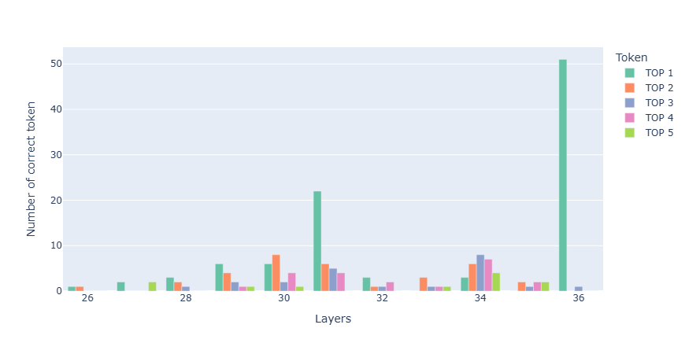

# LLM-Explainability-For-Geographical-Information

## Visualisation d'où se trouvent les noms des capitales dans le résidual stream de SmolLM3

Pour détecter si le nom de la capitale est présent dans le résidual steam :

1. nous comparons les TOP 5 tokens au premier token de la capitale tokenizé
2. nous comparons également les tokens décodés au nom de la capitale

Le risque avec la première comparaison étant que pour une capitale comme Copenhagen tokenizé en "C" et "openhagen", le token "C" seul sera comptabilisé comme capital présent dans la couche.

[ > Plot interactif](https://ThomasHtchn.github.io//LLM-Explainability-For-Geographical-Information/data/vizu-first-layer/smolLM3_vizu-first-layer_top10_th001_TTT.html)