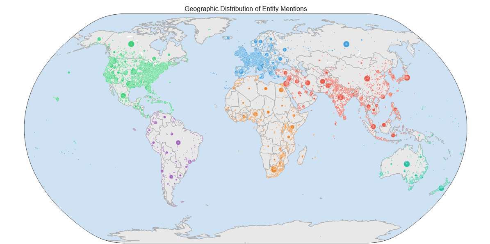
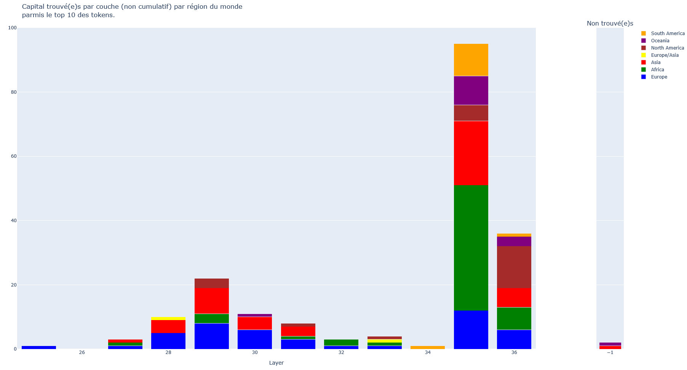
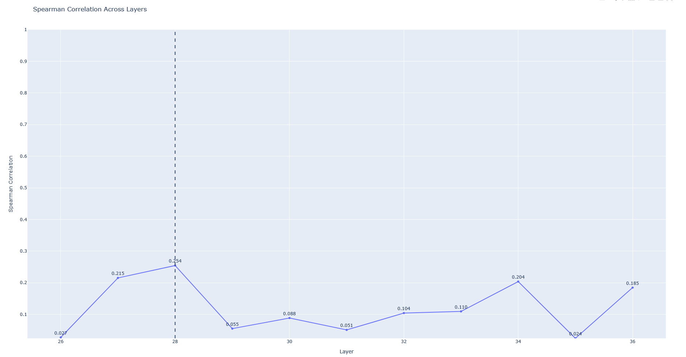

# LLM-Explainability-For-Geographical-Information

## TrainingDataset Spatial info
In this section we look at the trainingDataset of `SmolLM3-3B` : `FineWeb-edu`. Our goal is to extract the number of occurrences of geopolitical (GPE) and location (LOC) entities from SmolLM3-3B training datasets.
```
cd geocoding_pipeline
```
+ Set-up the environement, download data, create and fill DataBase for named-entity geocoding :
```
./setup_pipeline.sh
```
+ Run `Named-Entity Recognition (NER)` on `n_docs` streamed from `fineweb-edu` followed by `geocoding the entities` using `DB` from set-up & `photon API` :
```
./run_pipeline.sh <n_docs>
```
+ Clean results and cache files generated by the pipelines (--db to remove DB as well)
```
./clean_pipeline.sh --db 
```
+ Only extract entities from `fineweb-edu` with :
```
python extract_entities.py
    --n_docs <n_docs>
    --dataset <HuggingFaceFW/fineweb-edu>
    --output_path <entities_output.pkl>
```
+ Only geocode the entities from `entities_output.pkl` :
```
python geocode_entities.py
    --input_path <entities_output.pkl>
    --cache_path <geo_cache.pkl> # or none
    --db_path <geonames.db>
    --output_path <geocoding_output.csv>
```
+ Create worldmap visualisation of geocoded entities :
```
wget https://download.geonames.org/export/dump/countryInfo.txt
```
```
python vizualise_geocoding.py
    --input_path <geocoded_entities.csv>
    --n_docs <Number of geocoded docs>
    --output_path <plot_worldmap.html>
    --countries <Path to countryInfo.txt>
    --top_hover <Number of entities in the hover>
```
[](https://thomashtchn.github.io//LLM-Explainability-For-Geographical-Information/results/occ/plot_worldmap20k_fw.html)


## Probing
The probing experiences we run aim to identify SmolLM3-3B's geographically rich layers.

+ Setup the environment
```
conda env create -f env.yaml -n smollm || conda env update --prune -f env.yaml -n smollm
```

+ By countries, with capitals name

We try to find the capital in the residual stream of the LLM by using the decoding head (the last layer) of the model on the intermediate representations (hidden states). We use prompts such as `The <task> of <country name> is ` to probe the model and we compare the top 10 tokens from each layers to the first token of the tokenized capital.

[](https://thomashtchn.github.io//LLM-Explainability-For-Geographical-Information/results/stackedbar_regions_Capital.html)

+ Probing with different tasks : `ISO_Code`, `Dialing_Code`, `Continent`, `Capital`
```
python residualstream_vizualisation.py <data/countries.csv> <task> <HuggingFaceTB/SmolLM3-3B>
```
<br>

Using `GeoLLM` benchmark, we also look at how good each layer of the model is at predicting densities of population given gps coordinates and additional informations about the location as prompt.
```
cd geollm_scripts
```
+ Layers prediction of `population density`
```
python geollm_probing.py
    --prompts_path <jsonl prompts file>
    --task <Population Density>
    --model <HuggingFaceTB/SmolLM3-3B>
    --output_dir <layers_output>
```
+ Compute `Spearman correlation` between ground truth and layers predictions
```
wget https://github.com/rohinmanvi/GeoLLM/blob/main/data/ppp_2020_1km_Aggregated.tif
```
```
python calculate_spearman_correlation.py
    --groundtruth_tif <ppp_2020_1km_Aggregated.tif>
    --dir <layers_output>
```
[](https://thomashtchn.github.io//LLM-Explainability-For-Geographical-Information/results/probing/spearman_plot.html)

